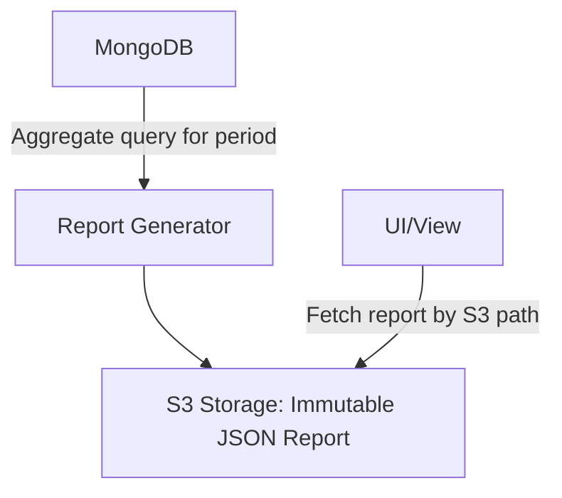
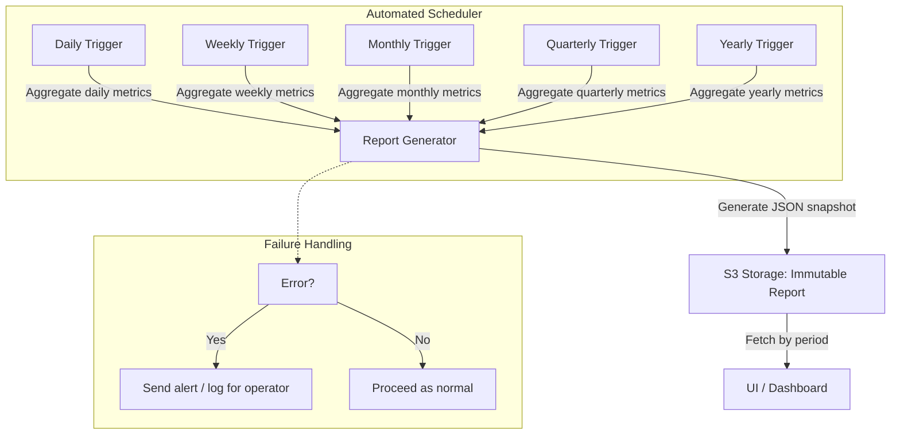

# RFC: ChatBot Insights

NOTE: Please edit in Suggesting mode.

| Authors:                 |       |
| :----------------------- | :---- |
| Comments requested from: |       |
| Comments due date:       |       |
| Current State:           | Draft |
| Decision:                |       |
| Decision date:           |       |
| Locations to notify:     |       |

---

## TL;DR

Search results in the ChatBot service are inconsistent due to incomplete or lagging indexing of conversations. ChatBot Insights is a proposed service that will:

- Collect metrics from the source database (MongoDB) and the search index (MeiliSearch).
- Reconcile differences between documents flagged for indexing and those actually available in the search index.
- Generate **report snapshots** over multiple time periods.
- Provide a view for monitoring trends and discrepancies.

---

## Context – What’s the problem?

The ChatBot service stores conversations and messages in MongoDB. A separate search index (MeiliSearch) is used for query functionality.

Current issues include:

- **Incomplete or inconsistent search indexing:** Not all documents flagged for indexing in MongoDB (`_meiliIndex: true`) are actually available in MeiliSearch.
- **Scaling issues:** As document volume grows, indexing throughput lags and causes drift between MongoDB and MeiliSearch counts.
- **Lack of visibility into metrics:** Teams lack systematic insight into database growth, indexing discrepancies, and search reliability over time.
- **Split monitoring tooling:** A metrics proxy sidecar exists for MeiliSearch, and Datadog notebooks are also used, but this creates duplication and inconsistency.

ChatBot Insights addresses this gap by **aggregating, reconciling, and presenting metrics** about the source database and indexed documents, with eventual consolidation into a single monitoring service.

---

## Guiding Principles

- Reports are **immutable snapshots**, one per aggregation period.
- Historical reports allow trend analysis and discrepancy monitoring.
- Trend analysis may involve aggregating multiple snapshots from storage, or querying the source database directly for custom date ranges.
- The service focuses on **tracking discrepancies between documents flagged for indexing and documents actually indexed**, without duplicating search index metrics already tracked elsewhere.
- Simplicity and cost-efficiency are prioritized; storage is primarily in S3.
- Reports are **fully automated** and require no human interaction unless a failure occurs.

---

## Report Storage Path Structure

Reports are stored in S3 using a **structured, predictable path**:

```
s3://<bucket_name>/reports/<period>/<YYYY>/<MM>/<DD>/<report_type>.json
```

- `<period>` → `daily`, `weekly`, `monthly`, `quarterly`, `yearly`
- `<YYYY>` → 4-digit year
- `<MM>` → 2-digit month (`01`–`12`)
- `<DD>` → 2-digit day (`01`–`31`)
- `<report_type>` → descriptive report name (e.g., `metrics_snapshot`)

**Examples:**

- Daily report (Sept 26, 2025):  
  `s3://chatbot-insights/reports/daily/2025/09/26/metrics_snapshot.json`

- Monthly report (Aug 2025):  
  `s3://chatbot-insights/reports/monthly/2025/08/metrics_snapshot.json`

- Quarterly report (Q3 2025):  
  `s3://chatbot-insights/reports/quarterly/2025/Q3/metrics_snapshot.json`

---

### Suggested UI Period Mapping

| UI Option        | Storage Path Period | Notes                                             |
| ---------------- | ------------------- | ------------------------------------------------- |
| Last 1 day       | `daily`             | Fetch yesterday’s snapshot                        |
| Last 7 days      | `daily`             | Aggregate last 7 daily snapshots                  |
| Last 30 days     | `monthly`           | Use monthly snapshot or aggregate daily snapshots |
| Specific Month   | `monthly`           | Direct mapping to monthly report path             |
| Specific Quarter | `quarterly`         | Map quarter to monthly/quarterly path             |
| Specific Year    | `yearly`            | Fetch yearly snapshot                             |

---

## Retention Policy for Reports

To avoid unnecessary storage costs:

| Period    | Retention Duration | Notes                                           |
| --------- | ------------------ | ----------------------------------------------- |
| Daily     | 30 days            | Keep the last month of daily snapshots          |
| Weekly    | 12 weeks           | Keep approximately 3 months of weekly snapshots |
| Monthly   | 24 months          | Keep 2 years of monthly snapshots               |
| Quarterly | 5 years            | Keep 5 years of quarterly snapshots             |
| Yearly    | 10 years           | Keep 10 years of yearly snapshots               |

- Retention policies are implemented using **S3 lifecycle rules**.
- Older snapshots can be automatically **archived to Glacier or deleted**.
- Ensures the system remains **cheap and scalable**.

---

## Architecture



**Explanation:**

- **MongoDB**: Source of messages and conversations, including `_meiliIndex: true` flags.
- **Report Generator**: Runs aggregation queries for the defined period, computes discrepancies, stores JSON report in S3.
- **S3 Storage**: Holds immutable report snapshots organized by period and date.
- **UI/View**: Fetches snapshot from S3 to display metrics; may support aggregation over multiple snapshots for trend analysis.

---

## Automated Scheduling and Workflow



---

## Data Model

Each snapshot report captures metrics for a defined time window:

```json
{
  "period": "monthly",
  "time_window_start": "2025-08-01T00:00:00Z",
  "time_window_end": "2025-08-31T23:59:59Z",
  "mongo": {
    "total_documents": 320000,
    "indexed_flagged_documents": 290000
  },
  "indexed_documents": {
    "total": 270000,
    "most_recent_indexed": "conv_12580"
  },
  "discrepancy": {
    "count_difference": 20000,
    "percentage_difference": 6.9
  },
  "metadata": {
    "notes": "Monthly report snapshot; all values computed at end of period",
    "tags": ["search", "indexing", "metrics"]
  }
}
```

---

### Metrics Growth Table (Example)

| Period    | MongoDB Documents | Indexed Flagged Docs | Indexed Documents | Discrepancy | Most Recent Indexed Document |
| --------- | ----------------- | -------------------- | ----------------- | ----------- | ---------------------------- |
| Daily     | 10,200            | 9,500                | 8,700             | 800         | conv_12345                   |
| Weekly    | 71,000            | 65,000               | 60,500            | 4,500       | conv_12420                   |
| Monthly   | 320,000           | 290,000              | 270,000           | 20,000      | conv_12580                   |
| Quarterly | 950,000           | 870,000              | 810,000           | 60,000      | conv_13012                   |
| Yearly    | 3,500,000         | 3,200,000            | 2,950,000         | 250,000     | conv_15000                   |

---

## Solutions Considered

| Option                    | Pros                                              | Cons                                                   |
| ------------------------- | ------------------------------------------------- | ------------------------------------------------------ |
| Store snapshots in S3     | Cheap, simple, immutable, easy to fetch by period | Trend analysis requires aggregating multiple snapshots |
| Store in SQL              | Queryable, supports analytics                     | Adds infrastructure and cost; more complex             |
| Store in flat files / Git | Versioned, simple                                 | Not scalable; non-cloud-native                         |

**Decision:** Store immutable JSON snapshots in **S3**, keyed by period and date, for simplicity, cost-efficiency, and extensibility.

---

## Future Enhancements

- **Trend aggregation across snapshots** (e.g. moving averages, anomaly detection).
- **Visualization improvements** (line charts, heatmaps, stacked area charts).
- **Dynamic date ranges and filtering.**
- **Alerting and notifications** when discrepancies exceed thresholds.
- **Index reconciliation automation** (detect + reindex missing documents).
- **Historical benchmarking** across quarters and years.

---

## Next Steps

1. Run MongoDB and MeiliSearch queries to collect baseline data (see separate runbook).
2. Export results into CSV and Google Sheets for visualization.
3. Finalize report schema and aggregation queries for each period.
4. Implement **automated report generator**.
5. Store report snapshots in S3 using structured paths.
6. Implement retention policies with S3 lifecycle rules.
7. Build UI/view to fetch and display reports by period.
8. Support aggregation of multiple snapshots for trend analysis.
